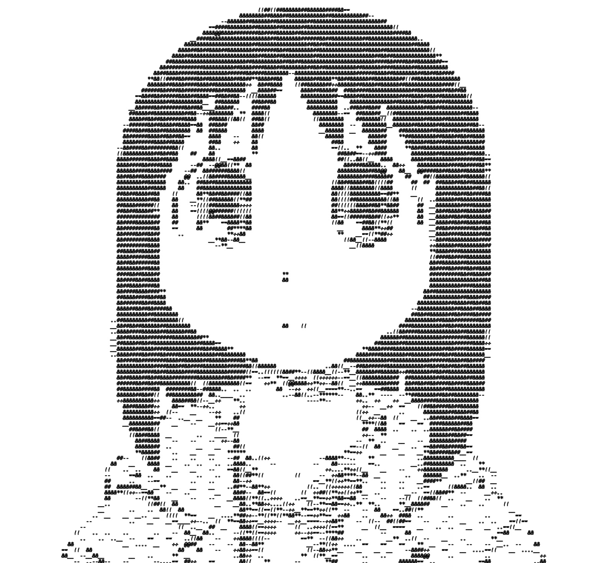
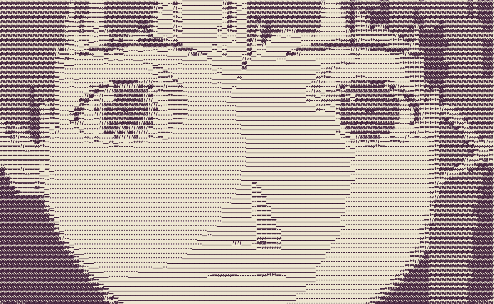

# ASCII art

## Usage

```c++
"D:/ASCII-Art/build/Debug/ascii-art.exe" --input=input/osaka.jpg --font=fonts/Consolas.ttf --output=output/osaka.jpg --background=#edcaeb --color=#db6bbc

"D:/ASCII-Art/build/Debug/ascii-art.exe" --input=input/707.gif --font=fonts/Consolas.ttf --output=output/707.mp4 --color=#e63959

"D:/ASCII-Art/build/Debug/ascii-art.exe" --input=input/smile-pepe.gif --font=fonts/Consolas.ttf --output=output/smile-pepe.mp4

"D:/ASCII-Art/build/Debug/ascii-art.exe" --input=input/lain.png --font=fonts/Consolas.ttf --output=output/lain.png --background=#ede6d1 --color=#3d1d38
```

## Notes

To use freetype you have to download the following libraries. I used *vcpkg* for package management.

```bash
# VCPKG_DEFAULT_TRIPLET
vckpg install harfbuzz 
vckpg install freetype
```

Then, when configuring the build files you have to enable ```WITH_FREETYPE``` option. I also had to modify the ```CMakeList.txt```  in OpenCV contributions [```/modules/freetype/CMakeLists.txt```](https://gist.github.com/UnaNancyOwen/14c72a3f10a46d41c359ab6ea307a1d2) to make it work.

Moreover, there were a ton of missing .dll files such as *libopenh264* and there was no *GIF* file support from the standard OpenCV library. So, I just used [**ffmpeg**](https://ffmpeg.org/download.html) as a command line tool to convert resulting *.mp4* to *.gif*.

## Output examples

<style>
  .image-container {
    display: flex;
    flex-wrap: wrap;
  }

  .image-container img {
    margin-right: 10px;
    margin-bottom: 10px;
    max-width: 100%;
  }

  @media (max-width: 400px) {
    .image-container img {
      width: 100%;
    }
  }
</style>

<div class="image-container">
  
  
  
  
</div>
